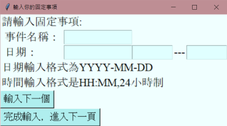
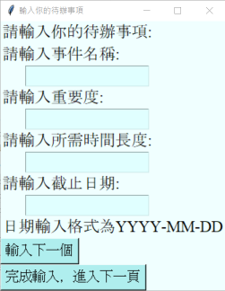
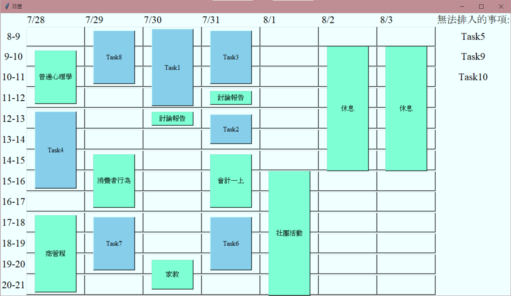

# 112PBC_Final

## 商管程期末專案--自動排程行事曆

本專案是112年度下學期，商管程式設計課程的期末專案。以python製作，目標是做出能夠以演算法自動排程的行事曆。
>>**展示影片**


<video src="基本運行_解說.mp4" controls="controls" width="500" height="300"></video>
```HTML
<video width="320" height="240" controls>
    <source src="基本運行_解說.mp4" type="video/mp4">
</video>
```

## 簡介

打開程式，首先會看到第一個輸入視窗:



這個視窗用來填入不須排程的固定行程，以學生為例，就像是課表這樣。



接下來的這個視窗用來填入需要利用演算法排程的事項
這些事項需要填入 **重要度、所需時間、截止日期** 等屬性讓演算法可以進行規劃

## 演算法 

>>成功接受資料後，進行處理。

>>本程式處理的邏輯如下:

1. **將固定事項排入行事曆**
1. **找出還能排程的空檔時間**
1. **依據重要度排序待排入事項**
1. **在截止時間前找出能排入的空閒時段並排入，如果無法，則另外紀錄。**
1. **輸出行事曆，行事曆右邊呈現無法排入的事項**

## 成果展示


